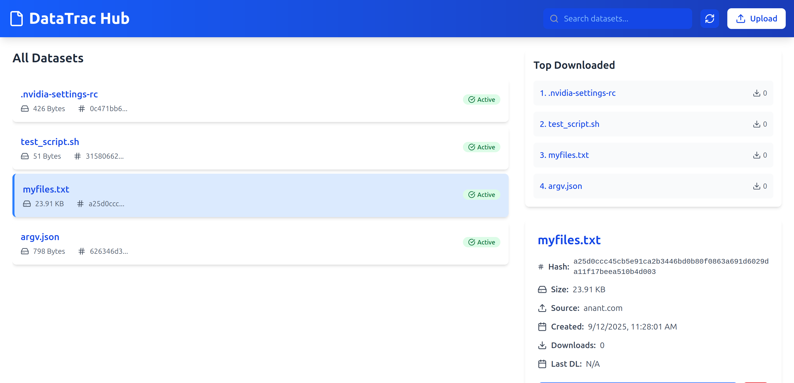
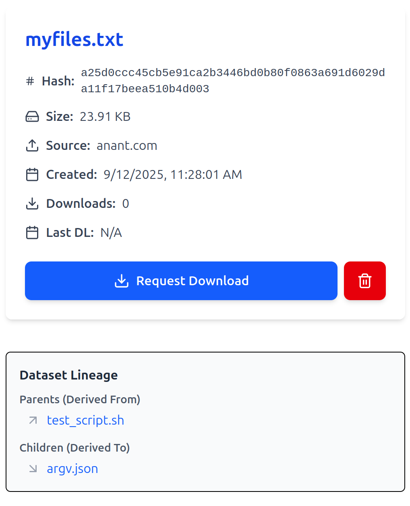
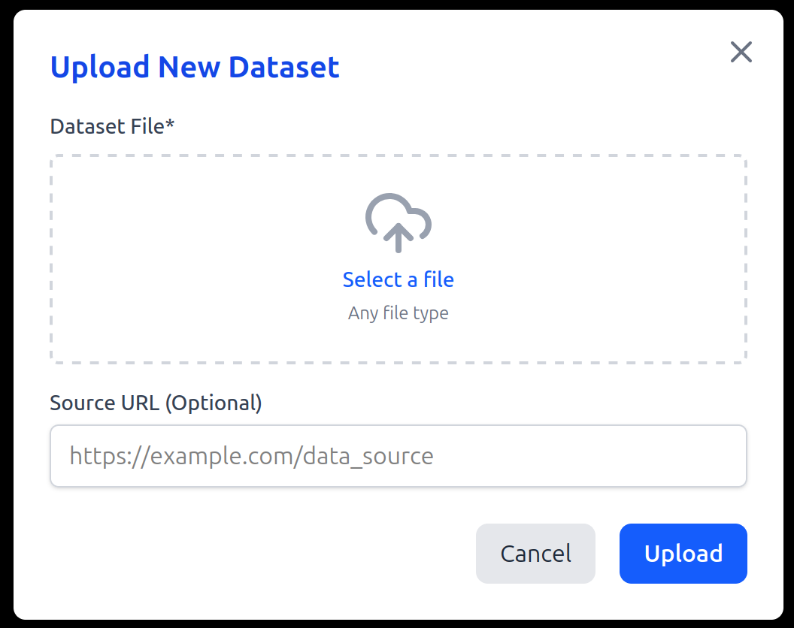

# datatrac - Dataset Discovery, Registry, and Lineage Tool

## Installation

**Install dependencies**:

   ```bash
   pip install --extra-index-url https://test.pypi.org/simple/ datatrac==0.0.5
   ```

## Quick Start

### Push your first dataset

```bash
datatrac push --source "https://example.com/" path/to/data.csv
```

### Fetch dataset details

```bash
datatrac fetch <dataset-hash>
```

### Download dataset

```bash
datatrac fetch --download <dataset-hash>
```

### List all datasets

```bash
datatrac fetch --all
--OR--
datatrac fetch -a
```

### View dataset lineage

```bash
datatrac lineage <dataset-hash>
```

### Create lineage between datasets

```bash
datatrac lineage --parent <parent-hash> --child <child-hash>
```

### Delete a dataset (Admin)

⚠️ Admin-only operation. Uses a hardcoded password (default: `admin`).

```bash
datatrac delete <dataset-hash>
```

### Delete only local copy

```bash
datatrac delete --local <dataset-hash> 
```

## Web Dashboard

### Start the API server

```bash
datatracweb
```

### Access the dashboard

Open your browser at: **[http://localhost:8000](http://localhost:8000)**

The dashboard shows:

* Dataset browser with search
* Top Downloaded Datasets
* Dataset details (size, hash, source, downloads, last download, creation date)
* Upload support
* Lineage Tracking

### Screenshots of Web Dashboard
Home Page


Dataset Details and Lineage View


Upload View


## Key Commands

| Command    | Description                        | Example                                 |
| ---------- | ---------------------------------- | --------------------------------------- |
| `push`     | Register a new dataset             | `datatrac push data.csv --source "url"` |
| `fetch`    | Show dataset info or download      | `datatrac fetch <hash>`                 |
| `fetch -a` | List all datasets                  | `datatrac fetch --all`                  |
| `lineage`  | View or create lineage links       | `datatrac lineage <hash>`               |
| `delete`   | Deregister or delete local dataset | `datatrac delete --local <hash> `        |

## Dataset Identification

Datasets can be referenced by:

* **Name**: original filename (e.g., `data.csv`)

## Notes

* Default admin password is **hardcoded** as `admin` (for proof of concept).
* Works with Python **3.12+** and uses **uv**, **typer**, **FastAPI**, **ReactJS** for package, command management and web dashboard.
* Frontend (React) is shipped prebuilt, no need for manual build required as static HTML is served through FastAPI.


